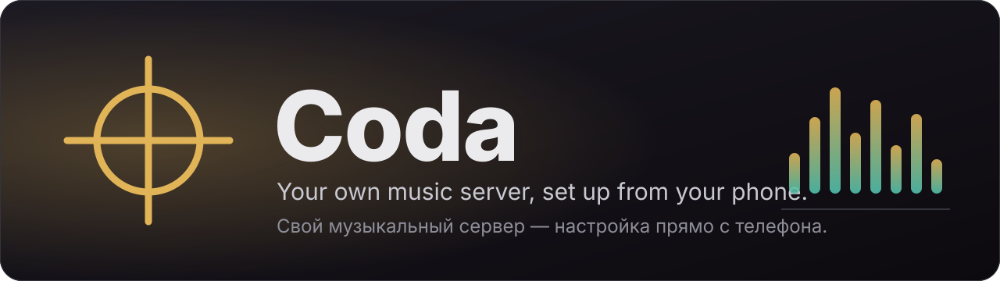
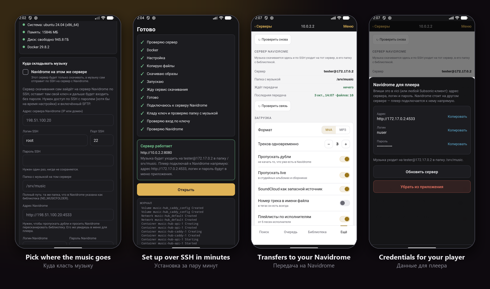
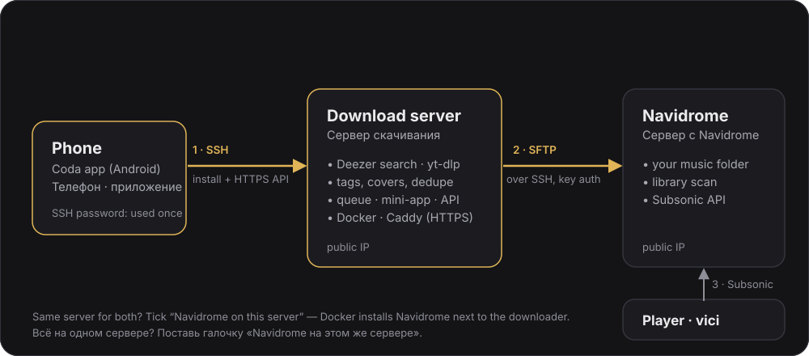

<p align="center">
  
</p>

<p align="center">
  <a href="https://github.com/Aut0iq/Coda/releases/latest"></a>
  <a href="https://github.com/Aut0iq/Coda/actions/workflows/apk.yml"></a>
  <a href="https://github.com/Aut0iq/Coda/actions/workflows/server.yml"></a>
  <a href="LICENSE"></a>
  
  <a href="https://www.navidrome.org/"></a>
  <a href="https://github.com/Aut0iq/Vici"></a>
</p>

<p align="center">
  <a href="#english"><b>English</b></a> · <a href="#русский">Русский</a>
</p>

<p align="center">
  
</p>
<p align="center">
  <sub>Choosing where the music is stored · installation over SSH · transfer to the Navidrome server · credentials for the player<br>
  Выбор места для музыки · установка по SSH · передача на сервер Navidrome · данные для плеера</sub>
</p>

<p align="center">
  
</p>

---

## English

**Coda** is an Android app that sets up your own server for downloading music into [Navidrome]. You enter the address, login and password of a Linux server; the app connects over SSH, installs everything that is needed and then works with that server: you search for an artist, choose an album, and the tracks appear in your Navidrome library with tags and covers.

> **Pairs with [Vici](https://github.com/Aut0iq/Vici).** Coda fills your Navidrome library; **Vici** is the player you listen to it in. Once the two are connected, search in Vici also shows songs and albums that are not on your server yet and lets you add them with a tap. Coda works on its own too: any Subsonic client can play the library.

The interface of the app is currently available in Russian only.

### Features

#### Setup

- **Installation from the phone.** No terminal is needed: the app checks the server, installs Docker, starts the containers and issues an HTTPS certificate.
- **One server or two.** Navidrome can be installed next to the downloader, or it can live on a separate server: the download server then logs in to it over SSH on its own and places the files in the folder you specify.
- **Your own music folder** in both layouts. The choice is kept across updates.
- **Updates and removal.** Running the installation again updates the server and keeps the token, passwords and data. The uninstaller never touches a music folder outside the installation directory.

#### Downloading

- **Search through Deezer**, audio through [yt-dlp]: YouTube first, then SoundCloud, account cookies for age-restricted tracks and your own proxies as fallbacks.
- **Accurate matching** by duration, title and channel, with tags and cover art written to every file.
- **Duplicates and live versions are skipped**: each track is checked against your Navidrome library first.
- **Playlists per artist** are created in Navidrome automatically.
- **A persistent queue** that continues after a restart of the server.

#### Reliability

- **The installation survives a lost connection.** It runs on the server independently of the phone; the app reconnects and continues reading the log from where it stopped.
- **Music is not lost when the Navidrome server is offline.** Files wait on the download server and are sent later, automatically or on request.
- **Safe transfer.** A file is uploaded under a temporary name and renamed only after its size is verified, so Navidrome never sees a partial file.
- **The downloader keeps itself up to date.** The server checks for a new yt-dlp every hour and before each download, installs it and restarts when nothing is being downloaded; the queue continues afterwards.
- **Network restrictions are reported.** If YouTube, Deezer or the Docker registries are blocked or throttled for the server, the app says so and suggests a VPN on the server or [zapret].

#### Security

- **The SSH password is never stored.** It is kept in memory during the installation only.
- **Key-based access between servers.** The password of the Navidrome server is used once; after that the download server logs in with its own key.
- **Host keys are pinned** at the first connection and verified on every subsequent one.
- **The API is protected by a token**, which is handed to the phone over SSH and stored in the system secure storage. Repeated wrong tokens block the address temporarily.

### Requirements

- **Download server:** Linux, x86_64 or arm64, SSH access with a password for `root` or a user with `sudo`. Tested on Ubuntu 24.04; other Debian-family systems are expected to work.
- **Ports:** 80 and 443 for HTTPS, or a single port of your choice without HTTPS.
- **Navidrome server (two-server layout only):** Navidrome is already running; SSH with password login is available at least during setup; SFTP is enabled; the SSH user can write to the folder that Navidrome uses as its library; the Navidrome address is reachable from the download server.

### Installation

Download the APK from the [latest release](https://github.com/Aut0iq/Coda/releases/latest) and open it on your device.

| File | Device |
|---|---|
| `coda-*-arm64-v8a.apk` | Almost every phone and tablet released after 2017. Recommended. |
| `coda-*-armeabi-v7a.apk` | Older 32-bit ARM devices. |
| `coda-*-x86_64.apk` | Android emulators, Chromebooks, x86 tablets. |
| `coda-*-x86.apk` | Old 32-bit x86 devices and emulators. |
| `coda-*-universal.apk` | Any of the above. The file is about 2.5 times larger. |

`SHA256SUMS.txt` is attached to every release. The APKs are signed with the standard Android debug key, which is suitable for direct installation but not for Google Play.

### Getting started

1. Open Coda and press **Подключить сервер** (Connect server).
2. Enter the address, login and password of the server and press **Проверить сервер** (Check server). The app shows the state of the server and of the network.
3. Choose where the music is stored:
   - keep **Navidrome на этом же сервере** (Navidrome on this server) enabled to install Navidrome next to the downloader, optionally with your own music folder;
   - or disable it and enter the address of the Navidrome server, its SSH login and password, the library folder on it, and the address and credentials of Navidrome itself.
4. Press **Установить** (Install). When the installation is finished, open the server, find an artist and choose an album.

#### Connecting Vici

The app menu contains the address, login and password of Navidrome: enter them in Vici or in any other Subsonic client. To let Vici search for music that is not in the library yet, press **Подключить vici** in the same menu, or enter the Coda address and token in Vici under *Settings → Coda*.

### How it works

1. **SSH, once.** The phone connects to the download server, uploads the installer and runs it. The installer starts the containers: `api` (the downloader), `caddy` (HTTPS) and, in the one-server layout, `navidrome`.
2. **HTTPS afterwards.** The app works with the API of the download server using a token. The main screen is a web interface served by that server, so it is updated together with the server.
3. **Two servers.** The download server generates its own key, places it in `authorized_keys` on the Navidrome server and verifies key login. Files are transferred over SFTP; after a successful transfer the local copy is removed and Navidrome is asked to rescan the library.

### Building from source

You need Node.js 22, JDK 17, the Android SDK and, for the tests, [Deno].

```bash
cd app
npm install     # also packs the server part into the app
npm test

npx expo prebuild --platform android --clean --no-install
cd android && ./gradlew assembleRelease -PreactNativeArchitectures=arm64-v8a
```

Use `x86_64` instead of `arm64-v8a` for an emulator. After changing anything in `server/`, run `npm run bundle` in `app/`: the app uploads the copy of the server that was packed at build time.

Server tests:

```bash
cd server/api
pip install -r requirements.txt
python -m unittest discover -s . -t . -p "test_*.py"
```

| Path | Contents |
|---|---|
| `app/` | The Android app: Expo 53, React Native 0.79 and a Kotlin SSH module. |
| `server/api/` | The downloader, its HTTP API and the web interface. |
| `server/deploy/` | The installer, the uninstaller, Docker Compose and Caddy files. |

Releases are built by GitHub Actions: pushing a tag `v*` that matches the version in `app/package.json` publishes the APKs.

### Limitations

- HTTPS with a Let's Encrypt certificate, installation of Docker on a server that does not have it, RHEL-family and arm64 servers have not been verified on real machines yet.
- In the two-server layout, requests to Navidrome (duplicate check, rescan, playlists) go from the download server directly to the Navidrome address, not through SSH.
- Installing Navidrome on a separate server from the app is not supported: it has to be running already.
- Without HTTPS the token is sent in clear text; the app warns about this.

### Responsible use

Coda is a tool for building a personal music library. You are responsible for the content you download and for complying with the terms of the services involved and with the laws that apply to you.

### Credits

- [Navidrome], the music server.
- [yt-dlp], the downloader.
- [Caddy], the web server that issues HTTPS certificates.
- [asyncssh] and [JSch](https://github.com/mwiede/jsch), the SSH libraries.
- [Expo](https://expo.dev/) and React Native.
- [Vici](https://github.com/Aut0iq/Vici), the player Coda is paired with.

### License

Coda is released under the [MIT](LICENSE) license © 2026 [Aut0iq](https://github.com/Aut0iq).

You are free to use, modify and distribute the code, including in your own projects, as long as the copyright notice and the license text are kept.

---

## Русский

**Coda** — приложение для Android, которое разворачивает ваш собственный сервер для скачивания музыки в [Navidrome]. Вы указываете адрес, логин и пароль Linux-сервера; приложение подключается по SSH, устанавливает всё необходимое и дальше работает с этим сервером: вы находите исполнителя, выбираете альбом, и треки появляются в вашей фонотеке Navidrome с тегами и обложками.

> **Работает в паре с [Vici](https://github.com/Aut0iq/Vici).** Coda пополняет фонотеку Navidrome, а **Vici** — плеер, в котором её слушают. Когда они подключены друг к другу, поиск в Vici показывает ещё и песни с альбомами, которых на сервере пока нет, — их можно добавить одним нажатием. Coda работает и сама по себе: фонотеку воспроизведёт любой клиент Subsonic.

Интерфейс приложения пока доступен только на русском языке.

### Возможности

#### Установка

- **Установка с телефона.** Терминал не нужен: приложение проверяет сервер, устанавливает Docker, запускает контейнеры и выпускает сертификат HTTPS.
- **Один сервер или два.** Navidrome можно установить рядом со скачиванием, а можно держать на отдельном сервере: тогда сервер скачивания сам подключается к нему по SSH и кладёт файлы в указанную вами папку.
- **Своя папка для музыки** в обоих вариантах. Выбор сохраняется при обновлениях.
- **Обновление и удаление.** Повторный запуск установки обновляет сервер и сохраняет токен, пароли и данные. Удаление не затрагивает папку с музыкой, если она находится вне каталога установки.

#### Скачивание

- **Поиск через Deezer**, звук через [yt-dlp]: сначала YouTube, затем SoundCloud; для роликов с возрастным ограничением используются cookies аккаунта, а ваши прокси служат запасным путём.
- **Точный подбор** по длительности, названию и каналу; в каждый файл записываются теги и обложка.
- **Дубли и концертные версии пропускаются**: каждый трек сначала сверяется с вашей фонотекой Navidrome.
- **Плейлисты по исполнителям** создаются в Navidrome автоматически.
- **Очередь сохраняется** и продолжается после перезапуска сервера.

#### Надёжность

- **Установка не зависит от связи.** Она идёт на сервере независимо от телефона; приложение переподключается и продолжает читать журнал с того места, где остановилось.
- **Музыка не теряется, если сервер Navidrome недоступен.** Файлы ждут на сервере скачивания и передаются позже — автоматически или по запросу.
- **Безопасная передача.** Файл загружается под временным именем и переименовывается только после проверки размера, поэтому Navidrome не видит недописанных файлов.
- **Загрузчик обновляется сам.** Сервер проверяет новую версию yt-dlp раз в час и перед каждой загрузкой, устанавливает её и перезапускается, когда ничего не скачивается; очередь после этого продолжается.
- **Сообщение о сетевых ограничениях.** Если YouTube, Deezer или реестры Docker для сервера недоступны или замедлены, приложение сообщает об этом и предлагает VPN на сервере или [zapret].

#### Безопасность

- **Пароль SSH нигде не сохраняется.** Он находится в памяти только во время установки.
- **Доступ между серверами по ключу.** Пароль сервера Navidrome используется один раз; после этого сервер скачивания входит по собственному ключу.
- **Ключи серверов запоминаются** при первом подключении и проверяются при каждом следующем.
- **API защищён токеном**, который передаётся телефону по SSH и хранится в защищённом хранилище системы. Повторные неверные токены временно блокируют адрес.

### Требования

- **Сервер скачивания:** Linux, x86_64 или arm64, доступ по SSH с паролем для `root` или пользователя с `sudo`. Проверено на Ubuntu 24.04; другие системы семейства Debian должны подойти.
- **Порты:** 80 и 443 для HTTPS либо один порт по вашему выбору без HTTPS.
- **Сервер Navidrome (только для варианта с двумя серверами):** Navidrome уже работает; вход по SSH с паролем доступен хотя бы на время настройки; SFTP включён; пользователь SSH может писать в папку, которую Navidrome использует как фонотеку; адрес Navidrome доступен с сервера скачивания.

### Установка

Скачайте APK со страницы [последнего релиза](https://github.com/Aut0iq/Coda/releases/latest) и откройте его на устройстве.

| Файл | Устройство |
|---|---|
| `coda-*-arm64-v8a.apk` | Почти любой телефон и планшет, выпущенный после 2017 года. Рекомендуется. |
| `coda-*-armeabi-v7a.apk` | Старые 32-битные устройства на ARM. |
| `coda-*-x86_64.apk` | Эмуляторы Android, Chromebook, планшеты на x86. |
| `coda-*-x86.apk` | Старые 32-битные устройства на x86 и эмуляторы. |
| `coda-*-universal.apk` | Любое из перечисленных. Файл примерно в 2,5 раза больше. |

К каждому релизу приложен `SHA256SUMS.txt`. APK подписаны стандартным отладочным ключом Android: он подходит для установки напрямую, но не для Google Play.

### Начало работы

1. Откройте Coda и нажмите **Подключить сервер**.
2. Введите адрес, логин и пароль сервера и нажмите **Проверить сервер**. Приложение покажет состояние сервера и сети.
3. Выберите, где будет храниться музыка:
   - оставьте включённым **Navidrome на этом же сервере**, чтобы установить Navidrome рядом со скачиванием, при желании указав свою папку для музыки;
   - либо отключите его и введите адрес сервера Navidrome, логин и пароль SSH, папку фонотеки на нём, а также адрес и учётные данные самого Navidrome.
4. Нажмите **Установить**. Когда установка завершится, откройте сервер, найдите исполнителя и выберите альбом.

#### Подключение Vici

В меню приложения указаны адрес, логин и пароль Navidrome: введите их в Vici или в любом другом клиенте Subsonic. Чтобы Vici мог искать музыку, которой ещё нет в фонотеке, нажмите **Подключить vici** в том же меню либо введите адрес и токен Coda в Vici в разделе *Настройки → Coda*.

### Как это работает

1. **SSH — один раз.** Телефон подключается к серверу скачивания, загружает установщик и запускает его. Установщик запускает контейнеры: `api` (скачивание), `caddy` (HTTPS) и, при варианте с одним сервером, `navidrome`.
2. **Дальше — HTTPS.** Приложение работает с API сервера скачивания по токену. Основной экран — веб-интерфейс, который отдаёт сам сервер, поэтому он обновляется вместе с сервером.
3. **Два сервера.** Сервер скачивания создаёт собственный ключ, помещает его в `authorized_keys` на сервере Navidrome и проверяет вход по ключу. Файлы передаются по SFTP; после успешной передачи локальная копия удаляется, а Navidrome получает запрос на пересканирование фонотеки.

### Сборка из исходников

Нужны Node.js 22, JDK 17, Android SDK и, для тестов, [Deno].

```bash
cd app
npm install     # заодно упаковывает серверную часть в приложение
npm test

npx expo prebuild --platform android --clean --no-install
cd android && ./gradlew assembleRelease -PreactNativeArchitectures=arm64-v8a
```

Для эмулятора укажите `x86_64` вместо `arm64-v8a`. После любого изменения в `server/` выполните `npm run bundle` в `app/`: приложение загружает на сервер ту копию серверной части, которая была упакована при сборке.

Тесты сервера:

```bash
cd server/api
pip install -r requirements.txt
python -m unittest discover -s . -t . -p "test_*.py"
```

| Каталог | Содержимое |
|---|---|
| `app/` | Приложение для Android: Expo 53, React Native 0.79 и модуль SSH на Kotlin. |
| `server/api/` | Скачивание, HTTP API и веб-интерфейс. |
| `server/deploy/` | Установщик, скрипт удаления, файлы Docker Compose и Caddy. |

Релизы собирает GitHub Actions: при отправке тега `v*`, совпадающего с версией в `app/package.json`, публикуются APK.

### Ограничения

- HTTPS с сертификатом Let's Encrypt, установка Docker на сервер, где его нет, серверы семейства RHEL и на arm64 пока не проверены на реальных машинах.
- При варианте с двумя серверами запросы к Navidrome (проверка дублей, пересканирование, плейлисты) идут с сервера скачивания напрямую на адрес Navidrome, а не через SSH.
- Установка Navidrome на отдельный сервер из приложения не поддерживается: он должен уже работать.
- Без HTTPS токен передаётся в открытом виде; приложение предупреждает об этом.

### Ответственное использование

Coda — инструмент для создания личной фонотеки. Вы самостоятельно отвечаете за скачиваемое содержимое и за соблюдение условий используемых сервисов и применимого к вам законодательства.

### Благодарности

- [Navidrome] — музыкальный сервер.
- [yt-dlp] — загрузчик.
- [Caddy] — веб-сервер, выпускающий сертификаты HTTPS.
- [asyncssh] и [JSch](https://github.com/mwiede/jsch) — библиотеки SSH.
- [Expo](https://expo.dev/) и React Native.
- [Vici](https://github.com/Aut0iq/Vici) — плеер, в паре с которым работает Coda.

### Лицензия

Coda распространяется под лицензией [MIT](LICENSE) © 2026 [Aut0iq](https://github.com/Aut0iq).

Код можно свободно использовать, изменять и распространять, в том числе в своих проектах, при условии сохранения уведомления об авторских правах и текста лицензии.

[Navidrome]: https://www.navidrome.org/
[yt-dlp]: https://github.com/yt-dlp/yt-dlp
[zapret]: https://github.com/bol-van/zapret
[Caddy]: https://caddyserver.com/
[asyncssh]: https://github.com/ronf/asyncssh
[Deno]: https://deno.com/
